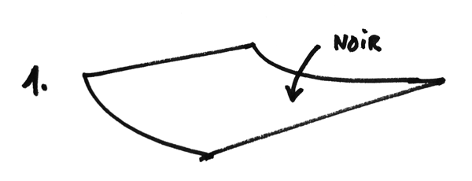
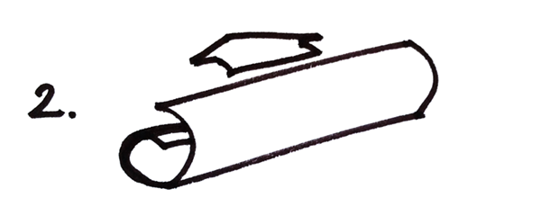
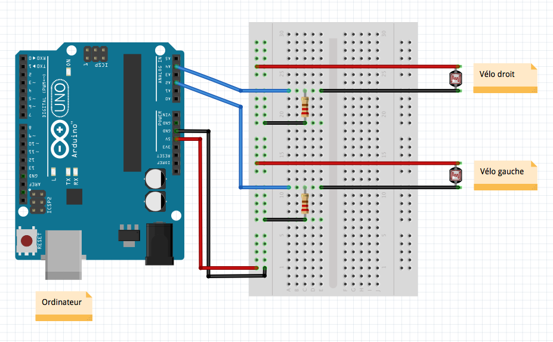

# Gare aux vélos !
Projet Gare Remix 2015

## Le dispositif

Deux usagers de la gare grimpent sur ce dispositif détournant deux vélos placés dans l’espace Ourà de la gare Saint-Paul. Qu’ils se connaissent ou non, ils doivent échanger et se coordonner pour pédaler ensemble afin de progresser dans un jeu insolite et ludique, semé d’obstacles et de contraintes. Mais attention ! Si l’un(e) pédale trop vite, les deux joueurs vont dans le mur ! Les vélos dormaient, les voilà réveillés pour des rencontres sociales inattendues ! Pour corser les choses, les autres usagers de la gare peuvent aussi participer au jeu en modifiant le parcours, via un hashtag sur Twitter. La durée de la partie est synchronisée avec les horaires des trains. Souriez en fin de partie, car l’œil de la Vidéo-dérision immortalise cette flânerie à vélo au cœur du Vieux Lyon. Et vive la vélorution !

Archive du projet & photos :
http://garemixsaintpaul.grandlyon.com/index.php/les-aboyeurs/

## Note

Ici est archivé la partie numérique / technique du dispositif, à vous d'entreprendre la réalisation des supports fixes des deux vélos et de l'espace de projection. ;)

## Matériel électronique requis

  * 1 carte Arduino (testé avec `Uno`) et son câble USB
  * 1 Breadboard
  * 2 capteurs de lumière
  * 2 résistances 220Ω
  * 6 petits câbles électriques (pour être confortable sur la Breadboard)
  * 4 longs câbles électriques (pour relier les capteurs des vélos à la carte Arduino)
  * Fer à souder, étain, scotch isolant

## Configuration & software requis

  * Ordinateur suffisamment puissant (testé avec un MacBook Pro 8Go de RAM)
  * Processing (testé avec `2.2.1`)
  * Arduino (testé avec `1.0.6`)
  * Vidéo-projecteur (ou écran)
  * Câble VGA ou HDMI
  * Multiprises, rallonges
  * 2 néons / lampes de poche / sources lumineuses
  * Scotch

## Montage sur les vélos

Pour récupérer la vitesse relative de chaque vélo, il faut placer un capteur de lumière et une source lumineuse sur la fourche de la roue arrière, ainsi qu'un cache noir sur la moitié de la même roue. Le demi-cache va se placer entre le capteur de lumière et la source lumineuse "une fois sur deux" pour ainsi modifier la valeur numérique envoyée par le capteur de lumière au jeu ; le programme déduit ensuite la vitesse de la roue selon le nombre de "lumière/noir" sur 20 occurrences. Ci-dessous pas-à-pas les étapes de réalisation au cours de l'événement.

**Note** : ce n'est pas systématiquement la méthode optimale, mais celle-ci a fonctionné. ;) 

### ➜ Le capteur de lumière

Le capteur de lumière capte un grand angle de lumière, et il est difficile de filtrer la luminosité reçue en extérieur (en l'occurrence à la gare, parois vitrées et face à l'extérieur). Le capteur recevait comme valeur en condition éclairée autour de `650` et en condition cachée `550`, ce qui est suffisant mais assez instable (si le soleil se couche, le seuil serait réduit et les données faussées). Il faut donc limiter l'angle du capteur. Puisque je n'avais que peu de matériaux, j'ai opté pour un tube noir placé en prolongement du capteur, afin de réduire la luminosité captée. Et ça a très bien fonctionné ! Les valeurs oscillaient de `> 50` à `0`.

➜ 1 / Récupérer une feuille de papier noir (ou remplir un papier de noir avec un marqueur) de 10cm de longueur au moins sur 5cm de largeur.

➜ 2 / Enrouler la feuille sur elle-même afin que le noir soit **à l'intérieur** du tube, et de telle manière à ce que le capteur de lumière puisse s'y insérer par l'une des extrémités.

➜ 3 / Fixer la feuille pour que le tube soit solide.

## Schéma Arduino

